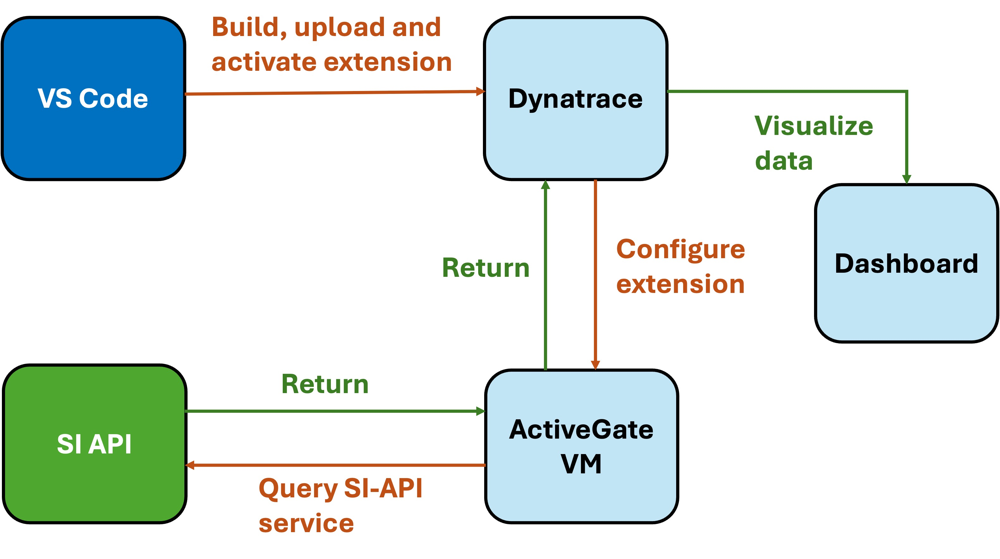
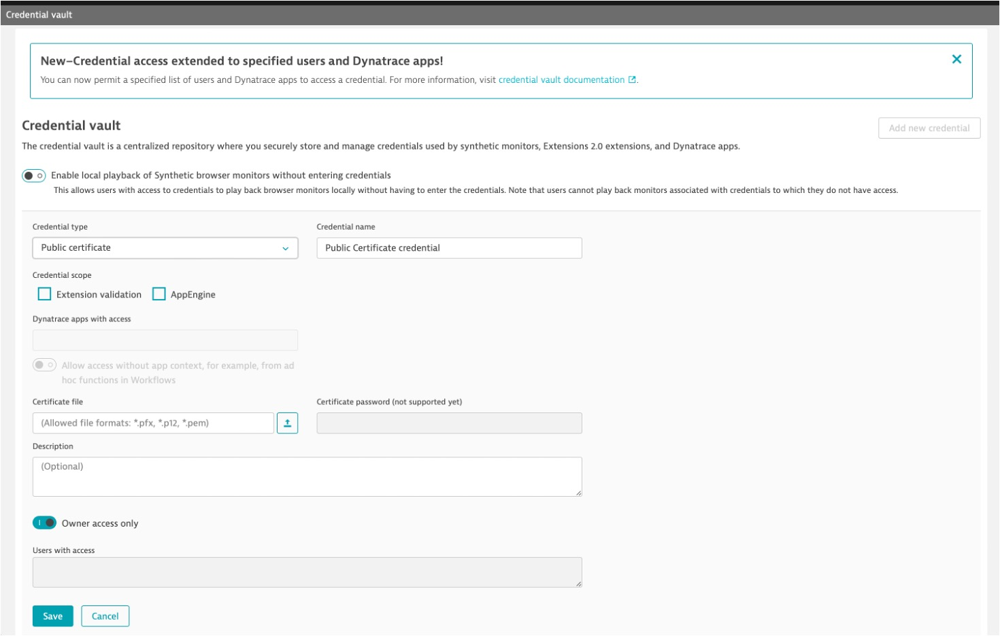
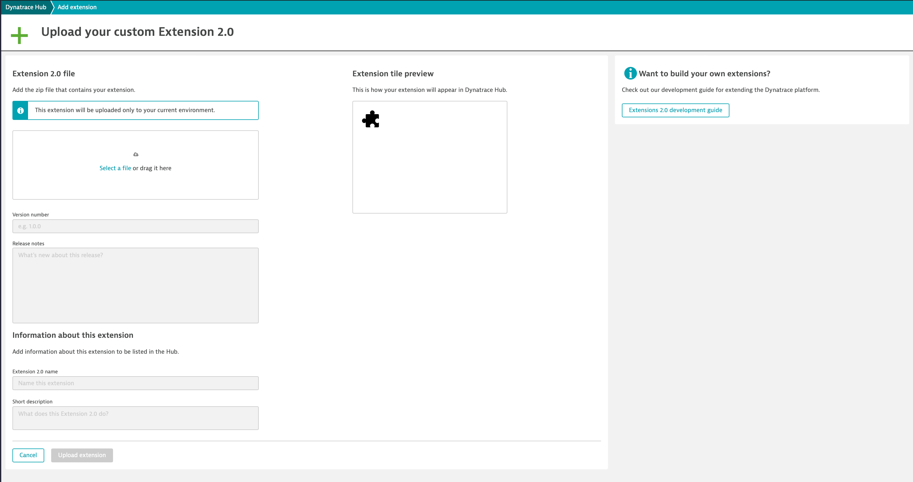
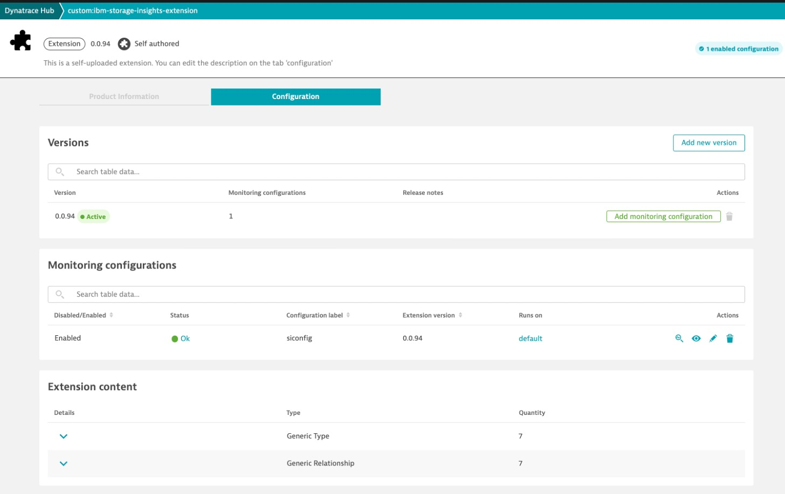
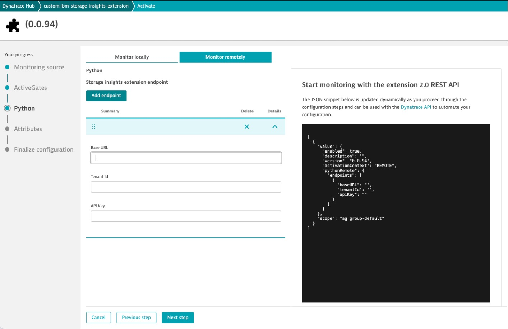
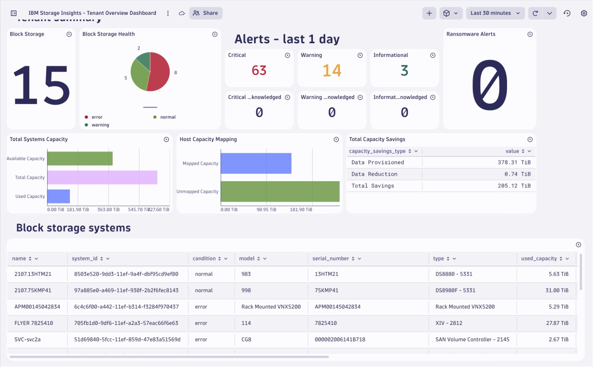
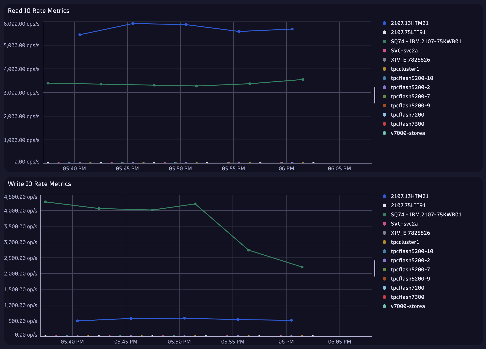
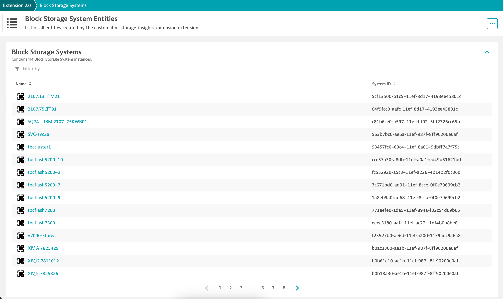

# 1. Introduction

[IBM Storage Insights](https://www.ibm.com/products/storage-insights) is a cloud based service that allows you to analyze, protect and optimize your storage infrastructure. It provides a single pane monitoring across your storage, fabric, and hosts. Gain insights into the status, health, capacity, and performance of the storage devices in your environment. Use this information to identify and troubleshoot problems, plan for your capacity needs, and identify performance bottlenecks.

Dynatrace is an open and extensible platform. You can extend the observability data collected out of the box with data provided by observability standards and frameworks such as OpenTelemetry and Prometheus. Dynatrace can ingest data from a wide range of tools available in the Dynatrace Hub, enabling continuous, actionable data flows that help quickly resolve issues, maintain complex systems, enhance code quality, and accelerate digital transformation. It acts as a single source of truth for observability.

The IBM Storage Insights Dynatrace Extension 2.0 enables customers to seamlessly monitor the health, capacity, and performance of their storage systems within IBM Storage Insights, utilizing Dynatrace dashboards for comprehensive visibility.

## 2. Dynatrace Extensions 2.0 Python SDK

- Get data in to Dynatrace using Extensions 2.0 framework

- The Dynatrace Extensions Python SDK provides you with a framework to ingest data into Dynatrace from any technology exposing an interface.

- It offers greater flexibility to ingest the data from your proprietary technologies or when your case requires extended customization that available data sources don't offer.

- Tooling to export your current OneAgent and ActiveGate extensions to the new framework.

- Dynatrace Extensions 2.0 Python SDK is publicly available with OneAgent 1.285 version onwards.

## 3. IBM Storage Insights Dynatrace Extension Workflow Diagram

<div align="center">
  
</div>

- Create a new Python Extension.

- Build Python Extension.

- Configure Python Extension.

- Extension will start running in the configured ActiveGate VM.

- It connects to SI-API service in order to collect performance, capacity metrics and pushes them to Dynatrace.

- Visualize data using Dynatrace Dashboards.

## 4. Prerequisites For IBM Storage Insights Dynatrace Integration

1. Dynatrace instance 1.286+.
2. Install [Python 3.10.x](https://www.python.org/downloads/).
3. Install [dt-extensions-sdk](https://pypi.org/project/dt-extensions-sdk/) python package.
4. Install [git](https://git-scm.com/downloads).
5. Setup ActiveGate.
6. Please follow [ActiveGate Install Steps](https://docs.dynatrace.com/docs/setup-and-configuration/dynatrace-activegate/installation) to set it up on a VM.
7. Only Host based ActiveGate deployments on Windows, Linux virtual or physical machines supported.

## 5. Generate Dynatrace Extension 2.0 Certificates

1. Go to Home directory.
    ```bash
    cd ~
    ```
2. Generate extension 2.0 root, developer certificates by running the below command.
    ```bash
    dt-sdk gencerts
    ```
3. For Linux, the root, developer certificates namely ca.pem, ca.key and developer.pem will be generated inside /$HOME/.dynatrace/certificates folder. 

4. In Windows, the certificate path location is %UserProfile%\.dynatrace\certificates.

## 6. Build IBM Storage Insights Dynatrace Extension 2.0

1. Clone the GitHub repo.
   [https://github.ibm.com/arurajas/ibm-storage-insights-dynatrace-integration.git](https://github.ibm.com/arurajas/ibm-storage-insights-dynatrace-integration.git)
    ```bash
    git clone git@github.ibm.com:arurajas/ibm-storage-insights-dynatrace-integration.git.
    ```
2. Go to directory `ibm-storage-insights-dynatrace-integration/`.
    ```bash
    cd ibm-storage-insights-dynatrace-integration/
    ```
3. Create a new build by running the below command.
    ```bash
    dt-sdk build --extra-platform None
    ```
4. A zip file named custom_ibm-storage-insights-extension-0.0.1.zip will be generated inside dist folder.

## 7. Install IBM Storage Insights Dynatrace Extension 2.0

1. Login Dynatrace GUI -> Search -> Credential Vault.
2. Add extension root certificate, ca.pem generated in step 5.2 to Dynatrace Credential Vault. Go to Credential Vault -> Add new credential.
<div align="center">
  
</div>

3. Copy extension root certificate, ca.pem generated in step 5.3 to ActiveGate VM. For example in Linux, copy ca.pem to /var/lib/dynatrace/remotepluginmodule/agent/conf/certificates folder. 
4. Similarly in Windows machine, copy ca.pem to %ProgramData%\dynatrace\remotepluginmodule\agent\conf\certificates.
5. Upload extension zip file custom_ibm-storage-insights-extension-0.0.1.zip, generated in step 6.3 to Dynatrace using "Upload custom Extension 2.0" option. Go to Extensions -> Upload custom Extension 2.0
<div align="center">
  
</div>

## 8. Configure IBM Storage Insights Dynatrace Extension 2.0

1. Go to Extension -> Click on custom:ibm-storage-insights-extension

<div align="center">
  
</div>

2. Click on Monitor Remotely
3. Choose "Default" option and ensure your ActiveGate is visible
4. Click next and click on Add endpoint button

<div align="center">
  
</div>

5. Input Storage Insights Base URL. For example, https://insights.ibm.com
6. Tenant Id - It is Storage Insights Tenant UUID mentioned in the URL. For example, In https://insights.ibm.com/gui/{tenant_uuid}, the placeholder value of {tenant_uuid}.
7. API Key - This is an API key of Storage Insights Admin/Monitor user. Go to Storage Insights GUI -> Configuration -> User Access Management -> Rest API Keys.
8. Click on Next step.
9. Provide a monitoring config label name.
10. Click on Activate.

## 9. IBM Storage Insights Tenant Overview Dashboard

1. Go to Dashboards -> Upload -> Import storage_insights_tenant_overview_dashboard.json from dashboards folder.

- Click on Review all code -> Select Always trust code in this document option -> Accept and run.

- The dashboard view contains total number of block storage systems, its health status, alerts generated in last 24 hours that includes critical, warning and info count etc., ransomware alerts if any.

- Aggregated storage systems capacity view, host mappings capacity and total capacity savings views.

- Block storage systems details like storage system name, type, model, serial number, condition, used capacity, available capacity etc.

- Total number of alerts triggered at storage systems in last 24 hours.

- The default tenant overview dashboard refresh interval is 1 hour.

<div align="center">
  
</div>

## 10. IBM Storage Insights Tenant Performance Dashboard

1. Go to Dashboards -> Upload -> Import storage_insights_tenant_performance_dashboard.json from dashboards folder.

- Performance chart views of all Block storage systems.

- Read I/O Rate metrics.

- Write I/O Rate metrics.

- Total I/O Rate metrics.

- Read Data Rate metrics.

- Write Data Rate metrics.

- Total Data Rate metrics.

- Read Response Time metrics.

- Write Response Time metrics.

- Total Response Time metrics.

- The default tenant performance dashboard refresh interval is 30 minutes.

<div align="center">
  
</div>

## 11. IBM Storage Insights Tenant Storage Systems Dashboard

1. Go to Dashboards -> Select IBM Storage Insights - Tenant Overview  Dashboard -> Click on Storage Insights Block Systems Entities link at top right corner.

- List all Block storage systems.

- Select a particular storage system.

- List all Volumes.

- List all Storage Pools.

- List all Managed Disks.

- List all Drives.

- List all FC Ports.

- List all IP Ports.

- Top 5 Volumes performance metrics. Please use Dynatrace Data Explorer to view metrics for better results.

- The default tenant storage systems dashboard refresh interval is 2 hours.

- The default top 5 volumes performance metrics panel refresh interval is 30 minutes.

<div align="center">
  
</div>

## 12. Support for Issues and Improvement Requests
As an open-source project, the IBM Storage Insights Dynatrace integration follows a community-supported model, so IBM does not provide formal support for this dashboard. Designed as a do-it-yourself solution, it allows users to customize and troubleshoot independently. However, if you encounter issues or have ideas for improvements, you can connect with the project’s contributors and submit your requests via the project’s GitHub page.

